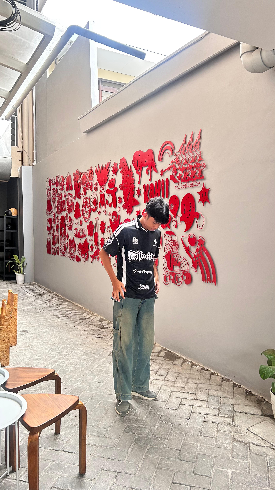

  
  <h1 align="center">
    Hi, I'm Dirgantry Leonard Nugrah Boro
  </h1>
  
  <h3 align="center" style="color:#E2001A;">A passionate developer proudly contributing at Telkomsel intern program.</h3>

---

### 👨‍💻 Tentang Saya :

  
  

- 🔭 Saat ini saya bekerja sebagai intern dan berinovasi bersama **Telkomsel**.

- 🌱 Saya sedang mendalami **beberapa skill seperti cloud computing, machine learning, data analyst, dan frontend skill**.

- 👯 Saya terbuka untuk berkolaborasi dalam proyek **apapun yang berkaitan dalam peningkatan skill saya**.

- 📫 Cara menghubungi saya: **futarokum6@gmail.com**

 

### 🛠️ Bahasa dan Tools:

### 🛠️ Bahasa dan Tools:

  
  
  
  
  
  
  
  
  
  

---